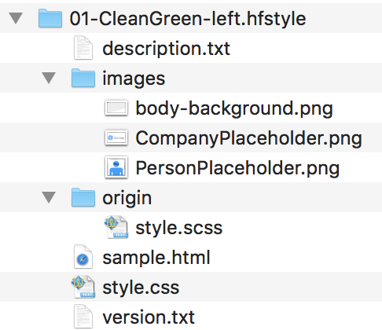

# HFUserStyles

This repository provides a guidance how you as a user of the [HappyFreelancer App](https://happyfreelancer.net) can create your own custom style and use it within the app.

# Prerequisites

* You are able to create CSS styles for a given HTML output.

# The Procedure

* The app generates an HTML file from your given data. 
* That HTML references a **style.css**, where you put all your stylings in. 
* Your custom style is provided as package with a defined structure to the app. 
* You provide your custom style through **iCloud Drive** and load it from within the app.
* Alternatively, you provide your custom style in any way to your iOS device and open it with the app.

# The Package Structure

